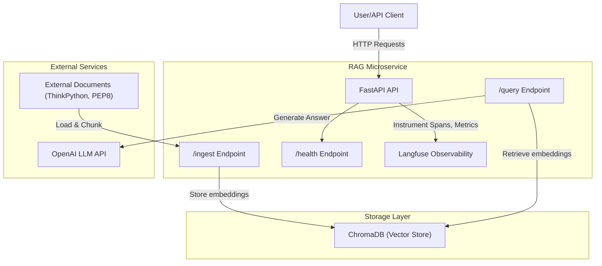

# RAG MICROSERVICE

+ Fast-API
    + [x] endpoints
    + [x] schemas
    + local  -> http://127.0.0.1:8000
    + docker -> http://0.0.0.0:8000/docs

+ Docker
    + [x] build
    + [x] run

+ Langfuse
    + [x] http://0.0.0.0:3000/auth/sign-in

+ [x] Docker-Compose

+ Ingest
    + [ ] filetypes: pdf | text | html | markdown
    + [ ] chunks
    + [ ] embeddings
    + [ ] vector db

+ LLM Query

---

